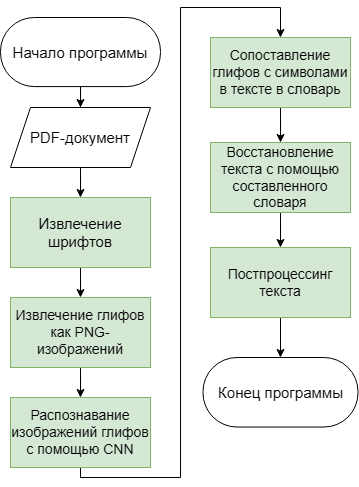
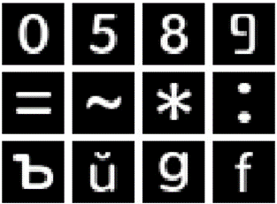
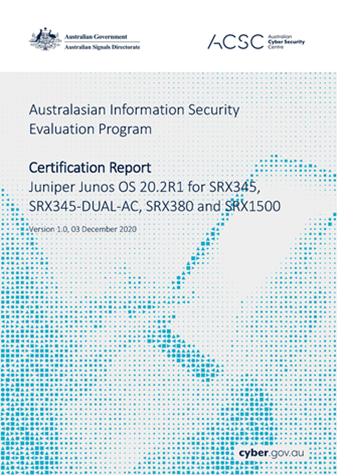

# BAD PDF Reader

**Проект предназначенный для извлечения текста из PDF-документов со сложным фоном и структурой**. Формат PDF представляет собой удобный инструмент для хранения и передачи документов. Преобразование документов и текстов в формат PDF не требует значительных усилий. Однако, преобразование данных из формата PDF обратно в исходный формат может представлять сложность из-за особенностей хранения информации в PDF и отсутствия простых и эффективных инструментов для выполнения таких операций.

Предложенный в проекте подход для извлечения текста из PDF-документов основан на анализе потока вывода текстовой информации формата PDF, что позволяет эффективно извлекать текст при работе с документами со сложной структурой, фоновыми элементами и некорректной кодировкой.

## Оглавление

1. [Особенности](#особенности)
2. [Быстрый старт](#быстрый-старт)
3. [Как это работает](#как-это-работает)
4. [Информация о нейронной сети](#информация-о-нейронной-сети)
5. [Оценка эффективности](#оценка-эффективности)

## Особенности

* **Высокая точность:** Превосходит традиционные OCR-решения (например, Tesseract в связке с Dedoc) при работе с узким классом документов со сложным фоном и/или структурой.
* **Работа со сложными PDF:** Эффективно обрабатывает документы с фоновыми изображениями, сложной версткой и некорректной кодировкой.
* **Восстановление PDF**: возможность создания нового PDF идентичного старому с возможностью копирования корректного текста.
* **Простота развертывания:** Запуск одной командой с помощью Docker Compose.

## Быстрый старт

### Требования

* `docker >= v24.0.6`
* `docker compose >= v23.3.0`

### Запуск

Клонируйте репозиторий и запустите проект:

```bash
git clone https://github.com/sinkudo/bad-pdf-reader
cd bad-pdf-reader
docker compose up
```

После успешного запуска сервис будет доступен по адресу: `http://localhost:3000`

## Как это работает



### 1. Извлечение шрифтов

Из PDF-документа извлекаются все необходимые для восстановления текста шрифта.

### 2. Извлечение глифов как PNG-изображений

Из раннее извлеченных шрифтов извлекаются все визуальные представления символов (глифы) как изображения формата png.

### 3. Распознование изображений глифов с помощью CNN (свёрточной нейронной сети)

Сверточные нейронные сети (CNN) особенно эффективны для задач распознавания образов, таких как распознавание глифов. Уже обученная CNN используется для идентификации глифов в извлеченных изображениях

### 4. Сопоставление глифов с символами в тексте в словарь

После того как глифы были идентифицированы, они сопоставляются с соответствующими символами в тексте.

### 5. Восстановление текста

После формирования словаря соответствий начинается восстановление текста.

### 6. Постпроцессинг текста

Исправление ошибок полученных в результате работы нейронной сети.

## Информация о нейронной сети

### Информация о датасете

Формат изображений в наборе данных:

1. Одноканальные
2. 28x28 пикселей
3. Инвертированные цвета

Всего 286 различных шрифтов из которых извлекали 102 класса изображений разделенные на три выборки в следующем соотношении:

1. **Train** - 195 шрифтов, 20420 изображений (70%)
2. **Validation** - 72 шрифта, 7584 изображений (26%)
3. **Test** - 14 шрифтов, 1168 изображений (4%)

Каждому классу изображений соответствует одинаковое число изображений.

Пример:


### Параметры обучения CNN

* Количество эпох - 20
* Batch Size - 64
* Скорость обучения - 1e-3
* оптимизатор - Adam
* loss function - categorical_crossentropy

### Архитектура CNN

```
=====================================================================================================================================================================
Layer (type:depth-idx)                   Input Shape               Output Shape              Param #                   Kernel Shape              Mult-Adds
=====================================================================================================================================================================
CNNModel                                 [128, 1, 28, 28]          [128, 160]                --                        --                        --
├─Conv2d: 1-1                            [128, 1, 28, 28]          [128, 32, 26, 26]         320                       [3, 3]                    27,688,960
├─MaxPool2d: 1-2                         [128, 32, 26, 26]         [128, 32, 13, 13]         --                        2                         --
├─Conv2d: 1-3                            [128, 32, 13, 13]         [128, 64, 11, 11]         18,496                    [3, 3]                    286,466,048
├─MaxPool2d: 1-4                         [128, 64, 11, 11]         [128, 64, 5, 5]           --                        2                         --
├─Dropout: 1-5                           [128, 1600]               [128, 1600]               --                        --                        --
├─Linear: 1-6                            [128, 1600]               [128, 256]                409,856                   --                        52,461,568
├─Dropout: 1-7                           [128, 256]                [128, 256]                --                        --                        --
├─Linear: 1-8                            [128, 256]                [128, 160]                41,120                    --                        5,263,360
=====================================================================================================================================================================
Total params: 469,792
Trainable params: 469,792
Non-trainable params: 0
Total mult-adds (M): 371.88
=====================================================================================================================================================================

```

## Оценка эффективности

Для проведения тестирования были найдены документы, содержащие текстовый слой,
который характеризуется сложным фоном или структурой.

Пример:


Для оценки эффективности применялся метод, основанный на метрике Левенштейна.
Результаты оценки эффективности в сравнении с проектом [Dedoc](https://github.com/ispras/dedoc) использующим OCR Tesseract.

В таблице указывается имя PDF-документа, который участвовал в тестировании и полученное значение **Accuracy**, всего 14 документов, 12442 символов.

|  | Dedoc | Количество символов| Предложенный подход |
|----------|----------|----------|--|
Integratable isolation system |1281| 68%| 96%|
Брошюра Ростелеком |102| 0%| 71%|
Кафетерий льгот |608| 31%| 99%|
Брошюра StationGuard |1774| 55%| 99%|
Спецификация военного двухканального радио |2406| 62%| 98%|
Руководство по визуальному оформлению |130| 55%| 97%|
Брошюра для родителей детей до 5 лет |125| 0%| 99%|
Брошюра Biesse |347| 17%| 99%|
Брошюра, описывающая механизм подотчетности Asia Development Bank |265| 51%| 99%|
Exploration of Windows Vista Advanced Forensic Topics |393| 72%| 93%|
Средство Engineer Documentation Assistant – помощник в работе со сложной документацией |2380| 78%| 97%
Australasian Information Security Evaluation Program |175| 39%| 91%|
Canadian center for cyber security |166| 92%| 91%|
Мобильные компьютеры корпоративного класса |2290| 80%| 97%|
Средняя точность |  |50%| 95%|
